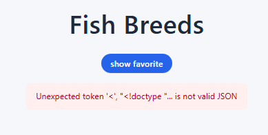
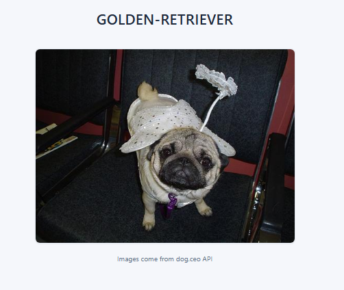
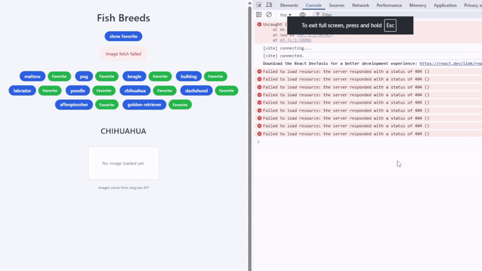
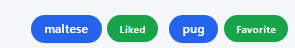
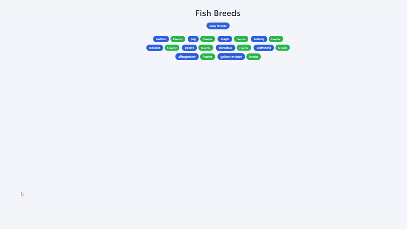

## Test Environment
- **Hardware:** Ryzen 9 7950x, RTX 4070 Ti Super, 48GB RAM
- **OS:** Windows 11
- **Browser:** Chrome
- **Viewport:** 1920x1080
- **Node Version:** [22.12.0]
- **Tools Used:** VS Code, Chrome DEV Tools
- **Testing Date:** 10/22/25

# Bug Report #1: Dog Breeds Page - Header Misspelling

## Summary

After the user correctly inputs their login information, the Breeds page displayed shows "Fish Breeds," when it should be "Dog Breeds."

## Affected Component

`src/components/Breeds.jsx`

## Location / Reference

Child of ```div class breeds```:

```jsx
<h1>Fish Breeds</h1>
```

## Priority

Minor – Users can continue using the Breeds page, although misspelling will confuse.

## Steps to Reproduce

1. Start dev server.
2. Open the app at `http://localhost:5173/`.
3. Log in and navigate to the Breeds page.
4. See the header of the page. 

    [](Picture)

## Expected Result

The header of the Breeds page displays "Dog Breeds."

## Actual Result

The header of the Breeds page displays "Fish Breeds."

## Impact / Risk

Users can continue interacting with the page as usual, with no risks, aside from confusion due to the misspelling.

## Root Cause (Hypothesized)

Header misspelling in the Breeds page.

## Suggested Fix

Change Breeds page header text to:

```jsx
<h1>Dog Breeds</h1>
```

# Bug Report #2: Dog Breeds Page - Displaying Incorrect Dog Breed Name Upon Selection

## Summary

When the user selects a dog breed, the text header displays a random type of dog, rather than the chosen dog breed.

## Affected Component

`src/components/Breeds.jsx`

## Location / Reference

Child of ```div class breeds-grid```:

```jsx
<h2>{randomBreed ? randomBreed.toUpperCase() : ''}</h2>
```

## Priority

Major – The user can see the correct dog breed image, but will not see an accurate header for any dog breed.

## Steps to Reproduce
1. Start dev server.
2. Open the app at `http://localhost:5173/`.
3. Log in and navigate to the Breeds page.
4. Click the 'pug' button.
5. See the text above the pug image. 

    [](Picture)

## Expected Result

The header accurately displays the dog breed chosen by the user.

## Actual Result

The header displays a random dog breed.

## Impact / Risk

Users can continue to interact with the page, but there will be confusion due to the misspelling of the header that displays the chosen dog breed.

## Root Cause (Hypothesized)

The header of dog breeds is randomly chosen when it should be displaying the selected dog breed. The issue is that `randomBreed` is used instead of `selectedBreed`.

## Suggested Fix

Change the selected breed's header text to:

```jsx
<h2>{selectedBreed ? selectedBreed.toUpperCase() : ''}</h2>
```

Remove:
```jsx
if (breeds.length) {
      const picked = breeds[Math.floor(Math.random() * breeds.length)];
      setRandomBreed(picked);
} else {
      setRandomBreed(null);
}
```

Also remove:
```jsx
const [randomBreed, setRandomBreed] = useState(null);
```

# Bug Report #3: Incorrect Formatting for API Fetching

## Summary

When the user selects the 'bulldog,' 'affenpinscher,' or 'golden-retriever' dog breeds on the Breeds page, no images are fetched, due to breeds.json having inaccurate formatting for those entries.

## Affected Component

`public/breeds.json`

## Location / Reference

Fourth entry, ```"bulldog "```.

Ninth entry, ```"Affenpinscher"```.

Tenth entry, ```"golden-retriever"```.

## Priority

Major – The user can see most of the images of dog breeds, except for bulldogs, affenpinschers, and golden retrievers.

## Steps to Reproduce

1. Start dev server.
2. Open the app at `http://localhost:5173/`.
3. Log in and navigate to Breeds page.
4. Click 'bulldog,' 'affenpinscher,' and 'golden-retriever' buttons.
    

## Expected Result

The API is given the correct entry names to find and display images for all dog breeds.

## Actual Result

No images are displayed for bulldogs, affenpinschers, or golden retrievers.

## Impact / Risk

Users can continue to interact with the page, although they cannot see images for bulldogs, affenpinschers, or golden retrievers.

## Root Cause (Hypothesized)

The ```breeds.json``` file contains three formatting errors that prevent successful API calls to the Dogceo API. These errors include inconsistent capitalization ("Affenpinscher"), trailing whitespace ("bulldog "), and incorrect sub-breed formatting ("golden-retriever"). The Dog CEO API requires all breed names to be lowercase and uses `breed/sub-breed` format for sub-breeds with a ```/``` separator.

## Suggested Fix

Change ```"Affenpinscher"``` to ```"affenpinscher"```.

Also change: ```"bulldog "``` to ```"bulldog"```.

Finally, change: ```"golden-retriever"``` to ```"retriever/golden"``` . Note: I used AI to help me determine the formatting for this particular object since it had a space, and I could not find that information in Dog CEO's documentation. I then verified that all three API calls worked.

# Bug Report #4: Breeds Page - Mislabeling of Like Button

## Summary

By default, all 'Like' buttons are labeled "Favorite," when they should be labeled "Like."

## Affected Component

`src/components/Breeds.jsx`

## Location / Reference

Child of ```li class breed-pair```:

```jsx
<button
    type="button"
    onClick={() => handleLike(breed)}
    className={"like-inline" + (liked[breed] ? " active" : "")}
    aria-pressed={liked[breed] ? 'true' : 'false'}
    >{liked[breed] ? 'Liked' : 'Favorite'}</button>
```

## Priority

Major – User can still like dog breeds, although, to them, they seem to be "favoriting" them rather than merely "liking" the dog breed.

## Steps to Reproduce

1. Start dev server.
2. Open app at `http://localhost:5173/`.
3. Log in and navigate to Breeds page.
4. Click the "Favorite" button.
5. See the text of the "Favorite" button change to "Liked." 

    [](Picture)

## Expected Result

The button should say "Like" by default, then, when clicked, display "Liked."

## Actual Result

Like button displays "Favorite" by default.

## Impact / Risk

Users can still like dog breeds, although they will think they favor dog breeds, and will be confused when they visit the "Favorites" page and do not see their supposed favorite dog breed.

## Root Cause (Hypothesized)

The button that handles likes is incorrectly labeled when a dog breed is not liked.

## Suggested Fix

Change:
```jsx
<button 
    type="button"
    onClick={() => handleLike(breed)}
    className={"like-inline" + (liked[breed] ? " active" : "")}
    aria-pressed={liked[breed] ? 'true' : 'false'}
    >{liked[breed] ? 'Liked' : 'Favorite'}</button>
```

To:
```jsx
<button 
    type="button"
    onClick={() => handleLike(breed)}
    className={"like-inline" + (liked[breed] ? " active" : "")}
    aria-pressed={liked[breed] ? 'true' : 'false'}
    >{liked[breed] ? 'Liked' : 'Like'}</button>
```

# Bug Report #5: Breeds Page - Missing Favorite Button

## Summary

There is no "Favorite" button, which will keep the user from favoriting their favorite dog breeds and cause the Favorite page never to reflect the user's current favorite dog breed.

## Affected Component

`src/components/Breeds.jsx`

`src/components/Favorite.jsx`

## Location / Reference

Missing "Favorite" button that is a child of ```li class breed-pair```:

```jsx
<li key={breed} className="breed-pair">
    <button className="breed-chip" onClick={() => handleBreedClick(breed)}>{breed}</button>
    <button
    type="button"
    onClick={() => handleLike(breed)}
    className={"like-inline" + (liked[breed] ? " active" : "")}
    aria-pressed={liked[breed] ? 'true' : 'false'}
    >{liked[breed] ? 'Liked' : 'Like'}</button>
</li>
```

## Priority

Critical – The user is still able to like dog breeds and see random images, but favoriting a dog breed is impossible.

## Steps to Reproduce

1. Start dev server.
2. Open app at `http://localhost:5173/`.
3. Log in and navigate to Breeds page.
4. See no "Favorite" button, aside from the mislabled "Like" button. 

    [](Picture)

## Expected Result

A "Favorite" button should likely be next to the "Like" button.

## Actual Result

The only button for each dog breed is the mislabled "Like" button.

## Impact / Risk

Users can still like dog breeds, but favoriting them is impossible.

## Root Cause (Hypothesized)

There is no "Favorite" button.

## Suggested Fix

Add a "Favorite" button next to the "Like" button and a mechanism that keeps multiple dog breeds from being liked simultaneously. Also ensure that when a user presses a different dog breed's "Favorite" button, the current favorite dog breed is unfavorited, and that corresponding "Favorite" button is reverted to a "Favorite" label. 

# Bug Report #6: Favorite Page - Displays Two Images Upon Loading

## Summary

When the user first goes to the Favorite page or refreshes, an image of the dog breed displays immediately, but is quickly replaced by another image.

## Affected Component
`src/components/Favorite.jsx`

## Location / Reference

Child of ```div class favorite```:

```jsx
<div className="image-frame" style={{marginTop:'1rem'}}>
    {loading && <div style={{padding:'2rem', fontSize:'.9rem', color:'var(--text-light)'}}>Loading husky image…</div>}
    {!loading && imageUrl && }
    {!loading && !imageUrl && !error && <div style={{padding:'2rem', fontSize:'.85rem', color:'var(--text-light)'}}>No image yet.</div>}
</div>
```

## Priority

Trivial – User can still see their favorite dog breed and the corresponding image, although it looks a little messy upon first visit or refreshing the page.

## Steps to Reproduce

1. Start dev server.
2. Open the app at `http://localhost:5173/`.
3. Log in and navigate to Breeds page.
4. Press the 'show favorite' button. 



## Expected Result

Only one image appears in the "Favorite" page.

## Actual Result

One image is quickly replaced by another.

## Impact / Risk

This only affects the aesthetic of the website.

## Root Cause (Hypothesized)

The ```div class image-frame``` seems to be causing the flicker to be worse than it is. 

## Suggested Fix

Preload the image.
